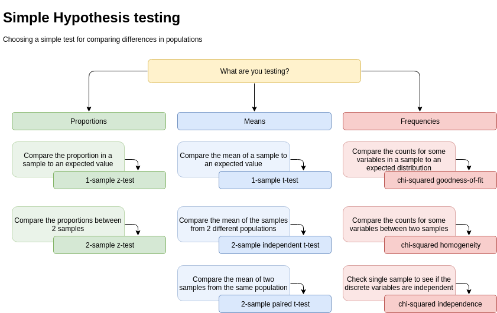

# Introduction to hypothesis testing

This project contains the working samples from the
 _[Introduction to hypothesis testing](https://sonalake.com/latest/an-introduction-to-hypothesis-testing/)_ 
 blog post series by [Sonalake](https://sonalake.com/).
 
The series of blog posts outlines in more detail what are the reasons for using these 
code samples.

## What test should I use?

The cheat sheet mentioned in the blog post is here: 

The different examples from the blog post are:

### Analysing proportions
* Compare the proportion in a sample to an expected value: 
[1-sample z test](examples/proportions/1-sample-z-test.py)
* Compare the proportions between 2 samples
[2-sample z test](examples/proportions/2-sample-z-test.py)

### Analysing means
* Compare the mean of a sample to an expected value
[1-sample t test](examples/means/1-sample-t-test.py)
* Compare the mean of the samples from 2 different populations
[2-sample independent z test](examples/means/2-sample-independent-t-test.py)
* Compare the mean of two samples from the same population
[2-sample paired t test](examples/means/2-sample-paired-t-test.py)

### Analysing frequencies
* Compare the counts for some variables in a sample to an expected distribution
[chi-squared goodness-of-fit](examples/frequencies/goodness-of-fit.py)
* Compare the counts for some variables between two samples
[chi-squared homogeneity](examples/frequencies/homogeneity.py)
* Check single sample to see if the discrete variables are independent
[chi-squared independence](examples/frequencies/independence.py)

## Setting up the project

First set up your environment:

    python3 -m venv env
    
Then set up your dependencies:

    env/bin/python -m pip install -r requirements.txt

You can use this `venv/bin/python` to run these examples, but
*PyCharm* will use this `virtualenv` as-is.

